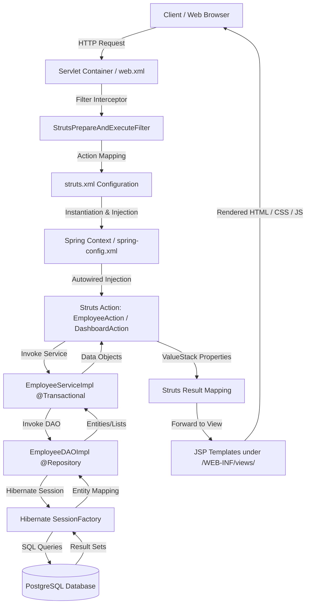

# Struts 2 Employee Management Application

A modern, high-performance **Employee Management System** built on **Java 8**, **Struts 2.5**, **Spring 5.3**, **Hibernate 5.6**, and **PostgreSQL**. The interface boasts a premium, dark-mode glassmorphic theme with interactive components and real-time visualization charts.

---

## 🚀 Key Features
1. **Interactive Dashboard**: Provides high-level metrics (Total Employees, Active Staff, Inactive Staff, and Average Salary) alongside a dynamic department distribution doughnut chart powered by **Chart.js**.
2. **Employee Directory**: Displays all registered employee records in a structured data table with custom name/email profile columns, status badges, and formatted salary localization.
3. **Advanced Filtering**: Live search by name/email and filters for department and status utilizing Java 8 Stream APIs.
4. **Comprehensive CRUD**: Add, edit, view details, and delete employee records with automated client-side confirmation and auto-fading notifications.
5. **Auto-seeding Database**: Auto-generates schemas and pre-populates PostgreSQL with 10 seed employees on first launch via a transactional initializer.

---

## 🛠️ Tech Stack
- **Runtime Environment**: Java 8 (JDK 1.8)
- **Web Controller**: Struts 2 (version `2.5.33`)
- **Dependency Injection & TX**: Spring Framework (version `5.3.29`)
- **ORM & Database Provider**: Hibernate Core (version `5.6.15.Final`) & PostgreSQL (version `42.6.0`)
- **Web Server**: Apache Tomcat 9 (or Jetty Maven Plugin)
- **Styling & Interactivity**: Vanilla CSS3 (Custom Dark Theme with Glassmorphism) & Vanilla JavaScript (Intl API, Chart.js)

---

## ⚙️ Database Configuration

Before starting the application, ensure you have a running PostgreSQL instance and create the database:

1. **Create Database**:
   Log into your PostgreSQL CLI (or use pgAdmin) and run:
   ```sql
   CREATE DATABASE employee_db;
   ```

2. **Configure Connection**:
   Database connection settings are located in [src/main/resources/db.properties](file:///c:/ramu/Project_Assignment/RapidX/FreddeMac_Project_RapidX/Research_Analysis/Java8Applications/struts2_application/src/main/resources/db.properties):
   ```properties
   db.driver=org.postgresql.Driver
   db.url=jdbc:postgresql://localhost:5432/employee_db
   db.username=postgres
   db.password=postgres
   db.dialect=org.hibernate.dialect.PostgreSQL9Dialect
   ```
   *Modify `db.username` and `db.password` if your database credentials differ.*

---

## 📦 How to Build the Project

Ensure your terminal environment has `JAVA_HOME` pointed to a JDK 8 installation. Compile and package the project into a `.war` file by running:

```bash
# Windows PowerShell
$env:JAVA_HOME="C:\ramu\softwares\jdk-8"
mvn clean package
```

The resulting package will be generated at:
`target/struts2-employee-app.war`

---

## 🏃 How to Run the Application

You can run the application using either **Apache Tomcat** or the **Jetty Maven Plugin**:

### Option A: Deploying to Apache Tomcat 9 (Recommended)
1. **Copy WAR file**:
   Copy the generated WAR archive to your Tomcat `webapps` folder:
   ```bash
   Copy-Item -Path "target\struts2-employee-app.war" -Destination "C:\ramu\tomcat-9.0.79\webapps\" -Force
   ```
2. **Start Tomcat**:
   Launch Tomcat from your console:
   ```bash
   $env:CATALINA_HOME="C:\ramu\tomcat-9.0.79"
   $env:JAVA_HOME="C:\ramu\softwares\jdk-8"
   C:\ramu\tomcat-9.0.79\bin\catalina.bat run
   ```
3. **Access URL**:
   Open your browser and navigate to:
   **[http://localhost:8080/struts2-employee-app/](http://localhost:8080/struts2-employee-app/)**

---

### Option B: Running via Jetty Maven Plugin
If you wish to run the app quickly using Maven without copying files:
1. **Run Jetty**:
   ```bash
   $env:JAVA_HOME="C:\ramu\softwares\jdk-8"
   mvn jetty:run
   ```
2. **Access URL**:
   Open your browser and navigate to:
   **[http://localhost:8080/](http://localhost:8080/)**

---

## 🔄 Application Flow & Architecture

The application is built using a classic 3-tier MVC architecture utilizing **Struts 2** (Web/Controller layer), **Spring** (Dependency Injection & Transaction Management), and **Hibernate** (ORM/Data layer) on top of a **PostgreSQL** database.

### 1. High-Level Architecture Flow



### 2. Application Startup & Initialization Flow

1. **Spring Container Boot**: The Servlet container starts and initializes the `ContextLoaderListener` (defined in [web.xml](file:///c:/ramu/Project_Assignment/RapidX/FreddeMac_Project_RapidX/Research_Analysis/Java8Applications/struts2_application/src/main/webapp/WEB-INF/web.xml)), which loads the Spring configurations from [spring-config.xml](file:///c:/ramu/Project_Assignment/RapidX/FreddeMac_Project_RapidX/Research_Analysis/Java8Applications/struts2_application/src/main/webapp/WEB-INF/spring-config.xml).
2. **Component Scan**: Spring scans `com.example.employee` package, automatically registering Actions, Services, and DAOs as beans.
3. **Database & ORM Setup**: 
   - Spring initializes the PostgreSQL datasource from connection details in [db.properties](file:///c:/ramu/Project_Assignment/RapidX/FreddeMac_Project_RapidX/Research_Analysis/Java8Applications/struts2_application/src/main/resources/db.properties).
   - The Hibernate `LocalSessionFactoryBean` maps the `@Entity` annotated class [Employee.java](file:///c:/ramu/Project_Assignment/RapidX/FreddeMac_Project_RapidX/Research_Analysis/Java8Applications/struts2_application/src/main/java/com/example/employee/entity/Employee.java) to the database.
   - `hbm2ddl.auto` is set to `update`, automatically creating or updating the schema.
4. **Auto-Database Seeding**: 
   - [EmployeeServiceImpl.java](file:///c:/ramu/Project_Assignment/RapidX/FreddeMac_Project_RapidX/Research_Analysis/Java8Applications/struts2_application/src/main/java/com/example/employee/service/impl/EmployeeServiceImpl.java) implements Spring's `InitializingBean` interface.
   - On container startup, Spring invokes `afterPropertiesSet()`, which runs a check on the database.
   - If the database is empty, a transactional template seeds it with 10 default employees.

### 3. MVC Request-Response Lifecycle Flow

To illustrate with a complete action workflow (e.g., viewing list of employees):

```
[Browser] 
   │ 
   │  1. HTTP Request: GET /listEmployees.action
   ▼
[StrutsPrepareAndExecuteFilter]
   │ 
   │  2. Resolves mapping to EmployeeAction.list() from struts.xml
   ▼
[EmployeeAction]
   │ 
   │  3. Spring Autowires EmployeeService implementation into EmployeeAction
   │  4. Action calls employeeService.getAllEmployees()
   ▼
[EmployeeServiceImpl]
   │ 
   │  5. Starts Transaction boundary (@Transactional)
   │  6. Calls employeeDAO.getAllEmployees()
   ▼
[EmployeeDAOImpl]
   │ 
   │  7. Retrieves Hibernate Session from SessionFactory
   │  8. Executes HQL query: "from Employee"
   ▼
[PostgreSQL Database]
   │ 
   │  9. Executes query and returns results
   ▼
[EmployeeDAOImpl] -> [EmployeeServiceImpl] -> [EmployeeAction]
   │ 
   │ 10. Service returns List<Employee> to Action
   │ 11. Action applies Java 8 Stream filters based on searchQuery, deptFilter, and statusFilter
   │ 12. List of filtered employees is stored in the action instance variable `employees`
   │ 13. Method returns "success" string
   ▼
[Struts Result Mapper]
   │ 
   │ 14. Matches "success" string to /WEB-INF/views/employee-list.jsp in struts.xml
   ▼
[employee-list.jsp]
   │ 
   │ 15. Extracts data from Struts ValueStack (e.g. using <s:property> or <s:iterator value="employees">)
   │ 16. Renders HTML with CSS styling and client-side scripts
   ▼
[Browser] 
      - Receives and renders modern dark-mode glassmorphic interface
```

### 4. Functional View Flow

- **Dashboard View** ([dashboard.jsp](file:///c:/ramu/Project_Assignment/RapidX/FreddeMac_Project_RapidX/Research_Analysis/Java8Applications/struts2_application/src/main/webapp/WEB-INF/views/dashboard.jsp)): Redirected from application root [index.jsp](file:///c:/ramu/Project_Assignment/RapidX/FreddeMac_Project_RapidX/Research_Analysis/Java8Applications/struts2_application/src/main/webapp/index.jsp) via `/dashboard` action. Displays summary metrics cards and department distribution charts powered by **Chart.js**. Uses Java 8 Stream API in [DashboardAction.java](file:///c:/ramu/Project_Assignment/RapidX/FreddeMac_Project_RapidX/Research_Analysis/Java8Applications/struts2_application/src/main/java/com/example/employee/action/DashboardAction.java) to calculate metrics (total count, active count, average salary) and group datasets.
- **Directory/Listing View** ([employee-list.jsp](file:///c:/ramu/Project_Assignment/RapidX/FreddeMac_Project_RapidX/Research_Analysis/Java8Applications/struts2_application/src/main/webapp/WEB-INF/views/employee-list.jsp)): Shows a data table of employees with support for live search (name/email) and drop-down filters (Department, Status). Uses streams inside [EmployeeAction.java](file:///c:/ramu/Project_Assignment/RapidX/FreddeMac_Project_RapidX/Research_Analysis/Java8Applications/struts2_application/src/main/java/com/example/employee/action/EmployeeAction.java) to filter the list.
- **View Details View** ([employee-detail.jsp](file:///c:/ramu/Project_Assignment/RapidX/FreddeMac_Project_RapidX/Research_Analysis/Java8Applications/struts2_application/src/main/webapp/WEB-INF/views/employee-detail.jsp)): Displays extensive card detail view for a specific employee.
- **Add/Edit Form View** ([employee-form.jsp](file:///c:/ramu/Project_Assignment/RapidX/FreddeMac_Project_RapidX/Research_Analysis/Java8Applications/struts2_application/src/main/webapp/WEB-INF/views/employee-form.jsp)): Displays input fields for employee attributes. Validations (mandatory fields, positive salary, valid dates) are run in the `save()` method of [EmployeeAction.java](file:///c:/ramu/Project_Assignment/RapidX/FreddeMac_Project_RapidX/Research_Analysis/Java8Applications/struts2_application/src/main/java/com/example/employee/action/EmployeeAction.java). If there are validation failures, the form is re-rendered with action/field errors; otherwise, it saves and redirects to the listing page.
- **Delete Action** (`/deleteEmployee?id=<id>`): Triggers standard deletion sequence via [EmployeeDAOImpl.java](file:///c:/ramu/Project_Assignment/RapidX/FreddeMac_Project_RapidX/Research_Analysis/Java8Applications/struts2_application/src/main/java/com/example/employee/dao/impl/EmployeeDAOImpl.java) and redirects back to the listing page.

